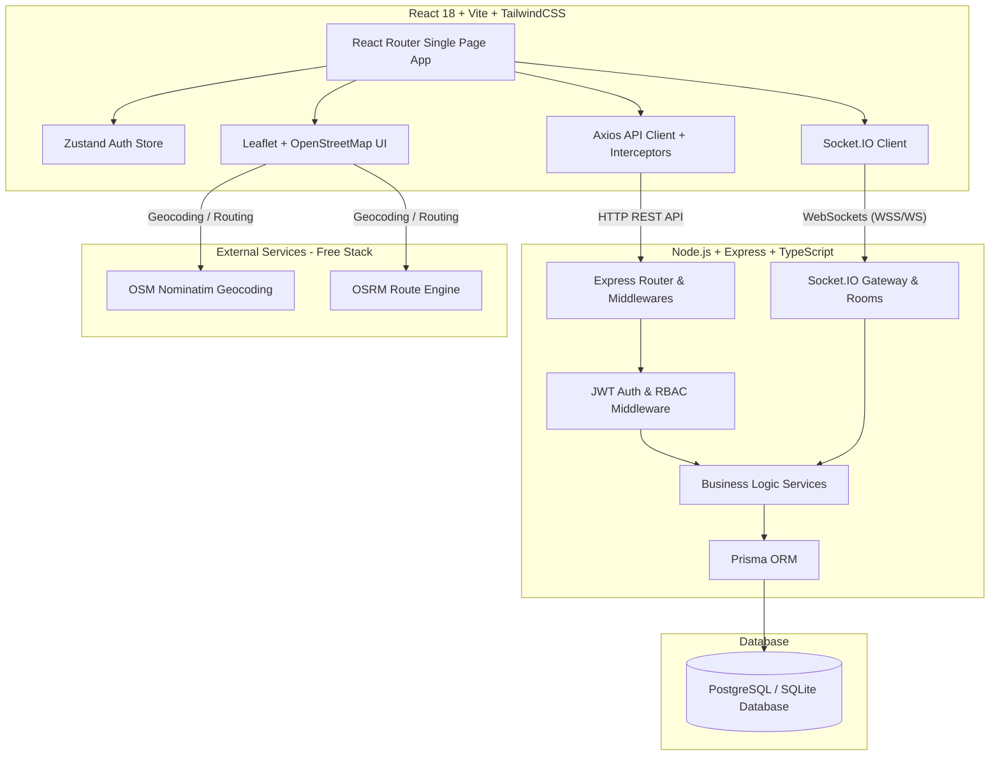
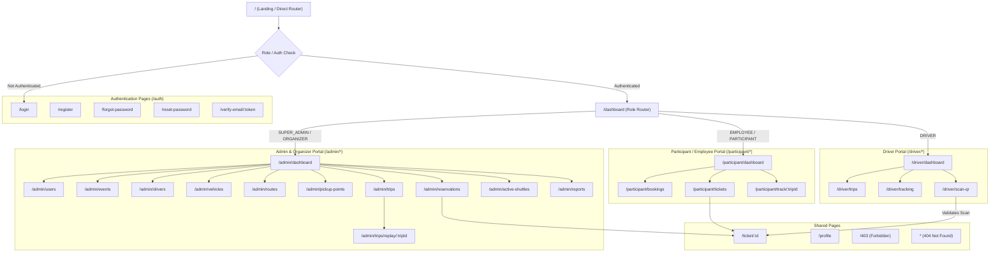
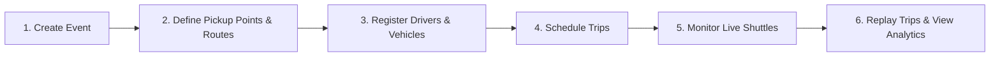
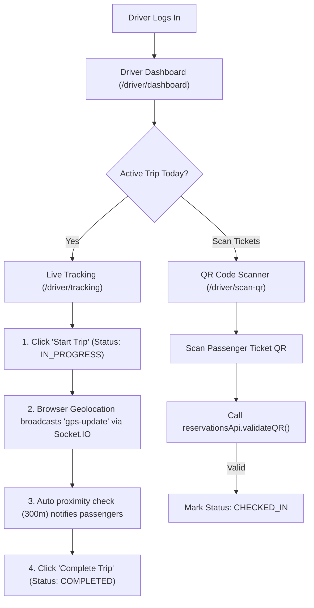
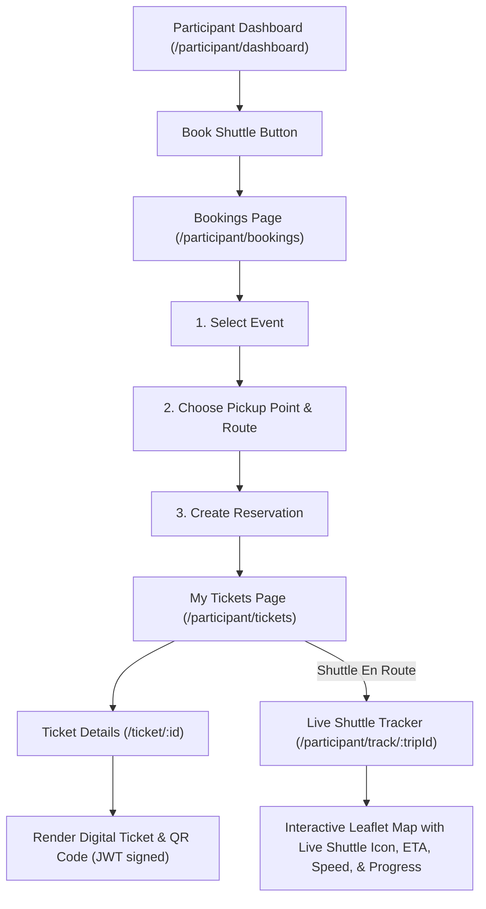
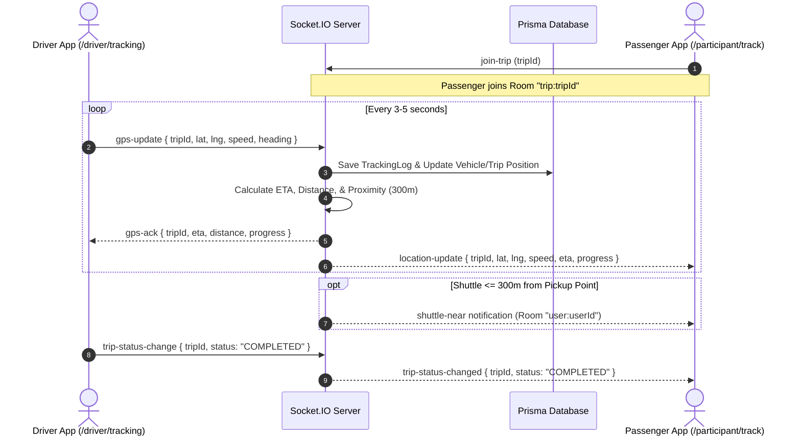
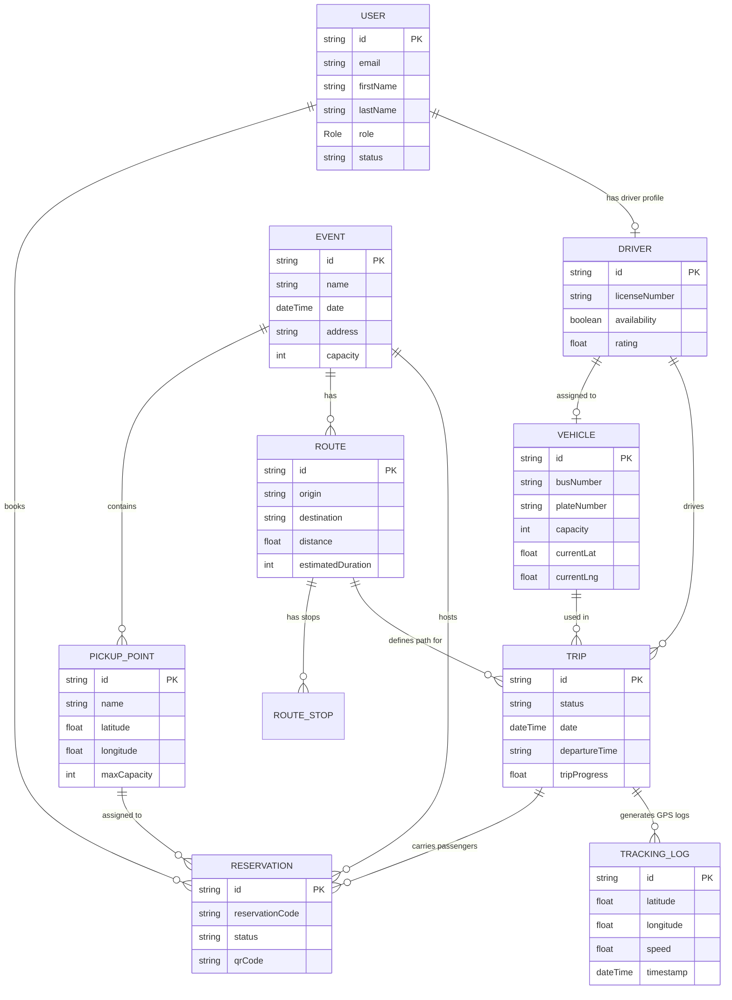

# Smart Shuttle Management System — System Architecture & Page Connection Guide

This document provides a comprehensive overview of the **Smart Shuttle Management System**, explaining its multi-role architecture, frontend routing structure, page interconnections, real-time WebSocket communication, backend service interactions, and data models.

---

## 1. High-Level Architecture Overview

The system follows a modern decoupled **Client-Server Architecture** with real-time bidirectional WebSocket communication.

### Core Technologies
- **Frontend**: React 18, Vite, TypeScript, TailwindCSS, Lucide Icons, Leaflet / React-Leaflet, Zustand (State), Axios, HTML5 QR Code Scanner.
- **Backend**: Node.js, Express.js, TypeScript, Socket.IO, Prisma ORM, Bcrypt, JsonWebToken.
- **Mapping & Routing (100% Free)**: Leaflet + OpenStreetMap + Nominatim (Geocoding) + OSRM (Routing). No Google Maps API key required.
- **Database**: PostgreSQL / SQLite managed by Prisma ORM.

---

## 2. User Roles & Access Control Matrix (RBAC)

The application has **4 distinct user roles**:

| Role | Access Level | Description | Primary Portal Route |
| :--- | :--- | :--- | :--- |
| `SUPER_ADMIN` | Full System Access | System owner with total access to all modules, reports, users, events, and shuttles. | `/admin/dashboard` |
| `ORGANIZER` | Event Manager | Manages events, pickup points, shuttle routes, driver assignments, and monitors live shuttles. | `/admin/dashboard` |
| `DRIVER` | Shuttle Operator | Operates assigned shuttles, broadcasts real-time GPS locations, updates trip status, and scans participant QR codes. | `/driver/dashboard` |
| `EMPLOYEE` / `PARTICIPANT` | Event Passenger | Browses events, books shuttle pickup points, views digital QR tickets, and tracks live shuttle location in real time. | `/participant/dashboard` |

---

## 3. Comprehensive Page Connection & Route Map

Below is the complete map of how all routes and pages in `App.tsx` connect, protected by `PrivateRoute` (role-based) and `PublicRoute` (unauthenticated).

---

## 4. Page Interconnection & User Flow Details

### 4.1 Authentication & Onboarding Flow
1. **Unauthenticated User** visits `/` $\rightarrow$ Redirected to `/login`.
2. **Login (`/login`)**: Validates credentials via `authApi.login()`. Saves JWT tokens (`accessToken` & `refreshToken`) in local storage and updates `useAuthStore`. Redirects to `/dashboard`.
3. **Register (`/register`)**: Creates new participant profile $\rightarrow$ triggers verification email link `/verify-email/:token`.
4. **Password Recovery**: `/forgot-password` sends password reset email link $\rightarrow$ `/reset-password` updates password.

---

### 4.2 Admin & Organizer Flow (`/admin/*`)
The Admin portal allows organizers to configure shuttle logistics from end-to-end:

- **Dashboard (`/admin/dashboard`)**: Displays total metrics (Events, Participants, Drivers, Vehicles, Active Trips, Reservations) and upcoming events.
- **Events (`/admin/events`)**: Manage event schedules, addresses, capacities, and poster images.
- **Pickup Points (`/admin/pickup-points`)**: Define geographical pickup locations (lat/lng) with max capacity for each event.
- **Routes (`/admin/routes`)**: Define origin, destination, and intermediate stops. Uses OSRM to calculate route path, distance, and duration.
- **Vehicles & Drivers (`/admin/vehicles`, `/admin/drivers`)**: Manage fleet buses and driver assignments.
- **Trips (`/admin/trips`)**: Connects an **Event + Route + Vehicle + Driver + Date/Time**.
- **Live Active Shuttles (`/admin/active-shuttles`)**: Real-time Leaflet map rendering all active shuttles simultaneously.
- **Trip Replay (`/admin/trips/replay/:tripId`)**: Step-by-step historic playback of GPS logs, speed, and stops for completed trips.
- **Reports & Analytics (`/admin/reports`)**: Daily/Weekly/Monthly metrics, vehicle occupancy rates, driver ratings, and route analytics charts.

---

### 4.3 Driver Flow (`/driver/*`)
Designed for mobile-friendly operation by bus drivers on the road:

---

### 4.4 Participant / Employee Flow (`/participant/*`)
Designed for smooth event shuttle booking and passenger experience:

---

## 5. Real-Time WebSockets Engine (`Socket.IO`)

Real-time location tracking and instant notifications are handled by Socket.IO rooms.

### WebSocket Socket Event Matrix

| Event Name | Direction | Payload | Room / Recipient | Purpose |
| :--- | :--- | :--- | :--- | :--- |
| `join-trip` | Client $\rightarrow$ Server | `tripId: string` | `trip:<tripId>` | Joins trip room for live tracking updates. |
| `leave-trip` | Client $\rightarrow$ Server | `tripId: string` | `trip:<tripId>` | Leaves trip tracking room. |
| `gps-update` | Driver $\rightarrow$ Server | `{ tripId, lat, lng, speed, heading }` | Server | Sends current vehicle coordinates from driver device. |
| `gps-ack` | Server $\rightarrow$ Driver | `{ tripId, eta, distance, progress, timestamp }` | Driver Socket | Acknowledges GPS log receipt with calculated ETA. |
| `location-update` | Server $\rightarrow$ Clients | `{ tripId, lat, lng, speed, estimatedArrival, progress }` | Room `trip:<tripId>` | Broadcasts smooth live vehicle marker movement to tracking maps. |
| `trip-status-change` | Driver $\rightarrow$ Server | `{ tripId, status }` | Server | Transitions trip status (SCHEDULED $\rightarrow$ IN_PROGRESS $\rightarrow$ COMPLETED / DELAYED). |
| `trip-status-changed` | Server $\rightarrow$ Clients | `{ tripId, status, label }` | Room `trip:<tripId>` | Notifies passengers of trip status updates. |
| `shuttle-near` | Server $\rightarrow$ Client | `{ pickupPoint, distance, tripId }` | Room `user:<userId>` | Alert sent when shuttle is within 300m of passenger pickup. |

---

## 6. Entity Data Model & Relationships

---

## 7. Summary Table of Frontend Pages & API Service Mappings

| Frontend Route | React Component | Access Roles | Connected API / Socket Services |
| :--- | :--- | :--- | :--- |
| `/login` | `Login.tsx` | Public | `authApi.login()` |
| `/register` | `Register.tsx` | Public | `authApi.register()` |
| `/forgot-password` | `ForgotPassword.tsx` | Public | `authApi.forgotPassword()` |
| `/reset-password` | `ResetPassword.tsx` | Public | `authApi.resetPassword()` |
| `/verify-email/:token`| `VerifyEmail.tsx` | Public | `authApi.verifyEmail()` |
| `/admin/dashboard` | `AdminDashboard.tsx` | Admin, Organizer | `dashboardApi.getAdmin()` |
| `/admin/users` | `AdminUsers.tsx` | Admin | `usersApi.*` |
| `/admin/events` | `AdminEvents.tsx` | Admin, Organizer | `eventsApi.*` |
| `/admin/drivers` | `AdminDrivers.tsx` | Admin, Organizer | `driversApi.*` |
| `/admin/vehicles` | `AdminVehicles.tsx` | Admin, Organizer | `vehiclesApi.*` |
| `/admin/routes` | `AdminRoutes.tsx` | Admin, Organizer | `routesApi.*`, Nominatim, OSRM |
| `/admin/pickup-points`| `AdminPickupPoints.tsx`| Admin, Organizer | `pickupPointsApi.*` |
| `/admin/reservations` | `AdminReservations.tsx` | Admin, Organizer | `reservationsApi.*` |
| `/admin/trips` | `AdminTrips.tsx` | Admin, Organizer | `tripsApi.*` |
| `/admin/trips/replay/:tripId`| `AdminReplayTrip.tsx`| Admin, Organizer | `trackingApi.replayTrip()` |
| `/admin/active-shuttles`| `AdminActiveShuttles.tsx`| Admin, Organizer | `trackingApi.getOrganizerMonitoring()`, Socket.IO |
| `/admin/reports` | `AdminReports.tsx` | Admin, Organizer | `reportsApi.*` |
| `/driver/dashboard` | `DriverDashboard.tsx` | Driver | `dashboardApi.getDriver()`, `trackingApi.getDriverCurrentTrip()` |
| `/driver/trips` | `DriverTrips.tsx` | Driver | `driversApi.getTodayTrips()` |
| `/driver/tracking` | `DriverTracking.tsx` | Driver | `trackingApi.updateLocation()`, `trackingApi.changeTripStatus()`, Socket.IO (`gps-update`) |
| `/driver/scan-qr` | `DriverScanQr.tsx` | Driver | `reservationsApi.validateQR()` |
| `/participant/dashboard`| `ParticipantDashboard.tsx`| Employee/Participant| `dashboardApi.getParticipant()` |
| `/participant/bookings` | `ParticipantBookings.tsx` | Employee/Participant| `eventsApi.getUpcoming()`, `reservationsApi.create()` |
| `/participant/tickets` | `ParticipantMyTickets.tsx`| Employee/Participant| `reservationsApi.getMyReservations()` |
| `/participant/track/:tripId`| `ParticipantTrack.tsx`| Employee/Participant| Socket.IO (`join-trip`, `location-update`), Leaflet Map |
| `/ticket/:id` | `TicketDetails.tsx` | Authenticated | `reservationsApi.getById()` |
| `/profile` | `Profile.tsx` | Authenticated | `authApi.getProfile()`, `authApi.updateProfile()`, `authApi.changePassword()` |

---

*Document generated for developer reference and system architecture review.*
